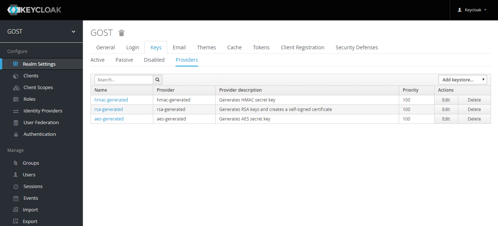
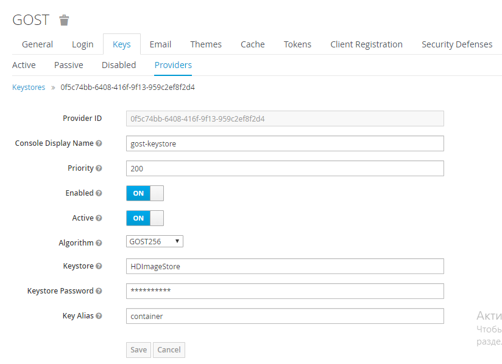
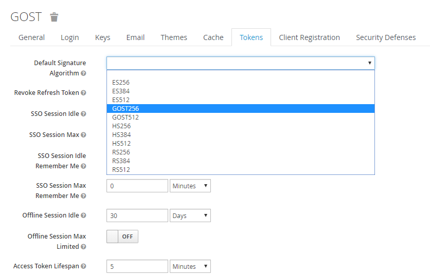

# Библиотека российских алгоритмов шифрования для Keycloak

Библиотека российских алгоритмов шифрования для [Keycloak](https://www.keycloak.org/)

Алгоритмы шифрования реализованы в [JCP](https://www.cryptopro.ru/products/csp/jcp)

В [Keycloak](https://www.keycloak.org/) добавлена совместимость со следующими алгоритмами шифрования:
+ ГОСТ Р 34.10-2012 (512) - **GOST256**
+ ГОСТ Р 34.10-2012 (256) - **GOST512**

### Совместимость
+ [Keycloak](https://www.keycloak.org/) - 4.8.3.Final
+ [JCP](https://www.cryptopro.ru/products/csp/jcp) - 2.0

### Настройка KeyStore
Для настройки KeyStore переходим в раздел **Providers** (*Real* &#8658; *Realm Settings* &#8658; *Keys* &#8658; 
*Providers*). В списке **Add keystore** выбираем **gost-keystore**.

В открывшемся оке заполняем поля:
1. Заполняем поле *Название* - **Console Display Name**.
2. Заполняем поле *Приоритет провайдера* - **Priority**.
3. Выбираем из списка *Алгоритм шифрования* - **Algorithm**, где 
+ **GOST256** - ГОСТ Р 34.10-2012 (512)
+ **GOST512** - ГОСТ Р 34.10-2012 (256)
4. Заполняем поле *Название хранилищя ключей и сертификатов* - **Keystore**.
5. Заполняем поле *Пароль от контейнера* - **Keystore Password** 
6. Заполняем поле *Название контейнера* - **Key Alias**
7. Нажимаем кнопку сохранить.

### Выбор алгоритма подписи токена.
Для выбора алгоритма подписи токена переходим в раздел **Tokens** (*Real* &#8658; *Realm Settings* &#8658; *Tokens*). 
В списке **Default Signature Algorithm** выбераем алгоритм подписи токена, где
+ **GOST256** - ГОСТ Р 34.10-2012 (512)
+ **GOST512** - ГОСТ Р 34.10-2012 (256)

